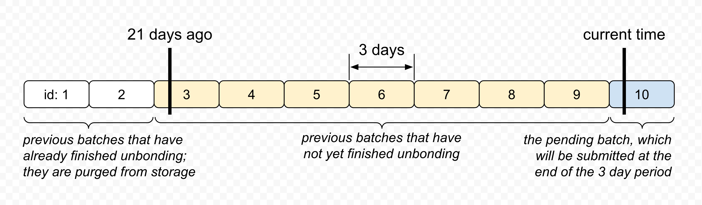

# Eris Stake Hub (Amplified Juno)

Eris Stake Hub contract manages the bonding/unbonding of Juno, minting/burning of ampJUNO, and reinvestment of staking rewards.

## Overview

### Exchange rate

Unlike [Lido's stETH](https://github.com/lidofinance/lido-dao/tree/master/contracts/0.4.24), the ampJUNO token does not rebase; instead, the exchange rate between Juno and ampJUNO increases (i.e. each ampJUNO becomes worth more Juno) as staking rewards are harvested, and reduces if validators are slashed.

The exchange rate, as defined by the amount of `ujuno` redeemable per `ustake`, is calculated as

```plain
exchange_rate = total_token_staked / total_ustake_supply
```

### Unlocked coins

Unlocked coin refers to coins held by the Eris Staking Hub contract (referred to as "the contract" hereafter) that can be reinvested. The contract tracks the amounts of unlocked coins using a `Vec<cosmwasm_std::Coin>` variable stored under the `unlocked_coins` key.

Each time the Hub contract delegates to or undelegates from a validator, the claimable staking rewards are automatically transferred to the contract. The amounts of coins transferred are recorded in the `coin_received` event. When handling the response, the contract parses this event and updates the `unlocked_coins` variable accordingly.

When harvesting, the contract needs to swap Terra stablecoins into Juno. the contract offers all unlocked coins that have exchange rates defined against Juno to be swapped, and deduct them from `unlocked_coins` accordingly. When handling the response, the contract parses the `swap` event and increments the unlocked Juno amount.

### Unbonding

Cosmos chains, by default, has a limit of 7 undelegations at a time per validator-delegator pair. In order to support unbonding requests from many users, the contract needs to bundle unbonding requests together and submit them in batches.



For mainnet, the contract will submit a batch every 3 days, such that there are at most 7 undelegations at a time with each validator. This 3 day interval is defined by the `epoch_period` parameter.

During the 3 day period, the contract accepts unbonding requests from users and store them in an `IndexedMap` data structure under the `unbond_requests` key, and the aggregated properties of the pending batch under the `pending_batch` key. Each user's share in the batch is proportional to the amount of ampJUNO tokens the user requests to burn.

At the end of the 3 day period, anyone can invoke the `ExecuteMsg::SubmitUnbond` function to submit the pending batch to be unbonded. The contract calculates the amount of Juno to unbond based on the Juno/ampJUNO exchange rate at the time, burns the ampJUNO tokens, and initiates undelegations with the validators.

At the end of the following 21 day unbonding period, the user can invoke the `ExecuteMsg::WithdrawUnbonded` function. The contract pulls all of the user's unclaimed unbonding requests, and refunds appropriate amounts of Juno based on the each request's share in that batch, to the user.
